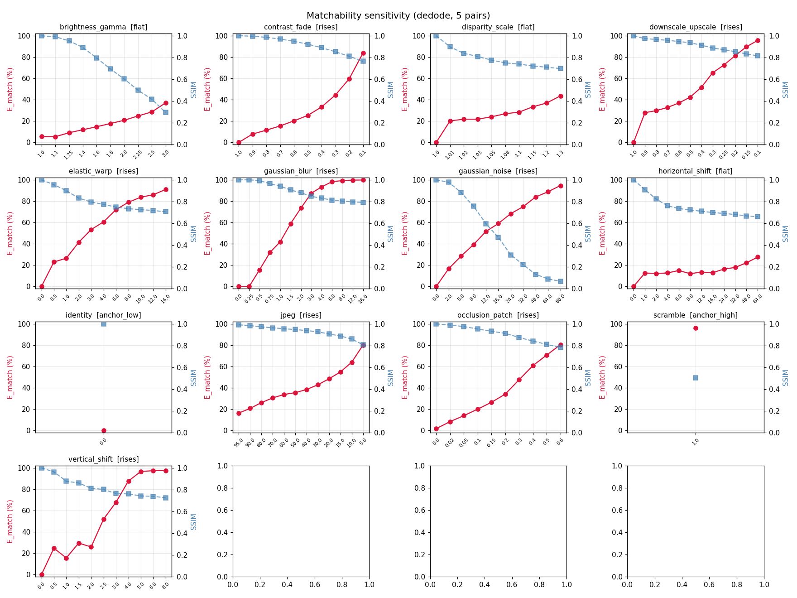
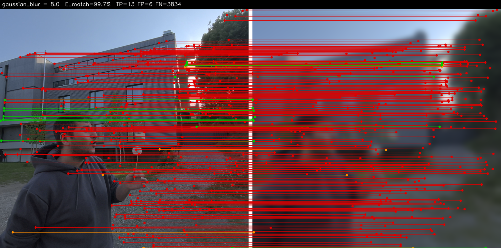
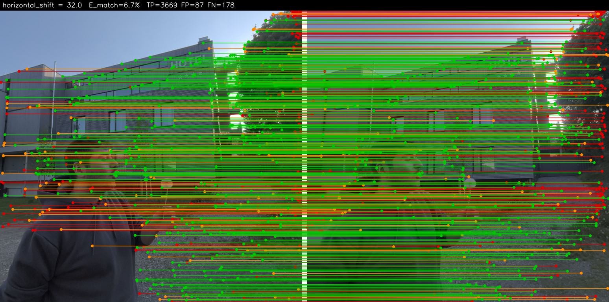

# Matchability

[](https://github.com/nandometzger/Matchability/actions/workflows/ci.yml)
[](LICENSE)
[](https://www.python.org)

A clean, tested reimplementation of the **Matchability Error** ($\mathcal{E}_{\text{Match}}$) — the
stereoscopic-fidelity / binocular-rivalry metric from
**[Elastic3D: Controllable Stereo Video Conversion with Guided Latent Decoding](https://elastic3d.github.io)**
(Metzger et al.). It measures whether a *predicted* right view preserves the same matchable, epipolar-consistent
texture as the *ground-truth* right view — a proxy for the binocular rivalry that makes synthesized stereo
uncomfortable to watch.

```python
from matchability import matchability_error

res = matchability_error(left, right_gt, right_pred)   # paths | PIL | numpy | torch all accepted
print(res.error_pct, res.tp, res.fp, res.fn)           # DeDoDe v2 auto-downloads on first call
```

## What it measures

Using a robust matcher (**DeDoDe v2**), we detect one fixed set of keypoints in the left image and ask which
of them have an **epipolar-consistent** match in the GT right view ($M_{gt}$) versus the predicted right view
($M_{pred}$). The error is the complement of their Jaccard index:

$$\mathcal{E}_{\text{Match}} = 1 - \frac{|M_{gt}\cap M_{pred}|}{|M_{gt}\cup M_{pred}|} = \frac{N_{FP}+N_{FN}}{N_{TP}+N_{FP}+N_{FN}}$$

- **TP** — correct, matchable detail preserved in both views.
- **FP** (hallucination) — detail matchable in the prediction but not the GT.
- **FN** (omission) — detail matchable in the GT but lost in the prediction (over-smoothing / blur).

A **lower** error means the synthesized view keeps consistent, matchable texture along the correct epipolar
geometry. The full operational definition (including the choices the paper leaves implicit) is in
[`docs/metric.md`](docs/metric.md).

## Install

```bash
pip install -e .          # torch + kornia come as core deps; DeDoDe v2 works out of the box
# optional extras:
pip install -e ".[viz]"   # matplotlib, for the sensitivity plots
pip install -e ".[dev]"   # pytest + ruff
```

The DeDoDe v2 checkpoint is auto-downloaded and cached on first use, and the device is auto-selected
(**mps** > cuda > cpu) — Apple-Silicon MPS is first-class.

## Usage

### Python

```python
from matchability import Matchability

metric = Matchability()                          # default DeDoDe v2; loads the model once
res = metric(left, right_gt, right_pred)
print(f"E_match = {res.error_pct:.1f}%  (TP={res.tp}, FP={res.fp}, FN={res.fn})")

# tune knobs / pick a device explicitly:
metric = Matchability(tau=2.0, n_keypoints=5000, working_resolution=768, device="mps")
```

### Command line

```bash
matchability left.png right_gt.png right_pred.png            # uses DeDoDe v2
matchability left.png right_gt.png right_pred.png --backend classical --viz overlay.png
```

### Backends

| Backend | Use | Notes |
| --- | --- | --- |
| `DeDoDeV2Matcher` (default) | faithful metric | kornia DeDoDe v2 (`L-C4-v2` + `G-upright`), MPS/CUDA/CPU |
| `ClassicalMatcher` | fast / weight-free | SIFT + mutual-NN; used in CI |
| `MockMatcher` | unit tests | deterministic, programmable |

The metric core is matcher-agnostic — pass any `Matcher` to `Matchability(matcher=...)`.

## Empirical validation

The metric is validated to reproduce the paper's sensitivity analysis (App. D.1). On real Apple Vision Pro
stereo pairs, distorting the predicted right view shows the signature **decoupling** of texture fidelity from
geometry:

- **Gaussian blur → error rises sharply** (over-smoothing destroys keypoints).
- **Horizontal shift → error stays flat** (DeDoDe is translation-invariant; geometry is measured separately).
- **Vertical shift → error rises** (breaks epipolar consistency).



*Each panel sweeps one distortion's severity (x-axis) and plots `E_match` in % (red) with SSIM (blue)
for reference — averaged over 5 real Apple Vision Pro stereo pairs with DeDoDe v2 at 512px.*

The TP/FP/FN decomposition is visible per match — **green** = true positive (texture preserved),
**orange** = false positive (hallucination), **red** = false negative (omission):

| Predicted right = blurred (texture lost) | Predicted right = shifted 32px (geometry only) |
| :---: | :---: |
|  |  |
| nearly all matches lost → **red**, `E_match ≈ 99%` | matches preserved → **green**, `E_match` stays low |

`E_match` averaged over 5 real AVP stereo pairs (DeDoDe v2, 512px, τ=2px), from least to most severe:

| Distortion | Expected | `E_match` min → max |
| --- | --- | --- |
| identity | baseline | 0.0% → 0.0% |
| **gaussian_blur** | rises sharply | **0.0% → 99.7%** |
| **vertical_shift** | rises (epipolar break) | **0.0% → 97.6%** |
| gaussian_noise | rises | 0.0% → 94.6% |
| downscale_upscale | rises | 0.0% → 95.6% |
| occlusion_patch | rises with area | 1.8% → 80.4% |
| jpeg | rises | 16.4% → 80.1% |
| **horizontal_shift** | flat (translation-invariant) | **0.0% → 27.5%** (at 64px) |
| brightness_gamma | flat-ish (photometric) | 5.5% → 37.1% |
| scramble | anchor (no correspondence) | 96.2% |

The full 13-distortion table and per-pair CSV are in
[`experiments/results/`](experiments/results/). Reproduce it:

```bash
python scripts/extract_frames.py --input-dir data/raw --output-dir data/frames
python scripts/run_sensitivity.py --backend dedode --working-resolution 512
# -> experiments/results/{sensitivity_grid.png, sensitivity.csv, summary.md, matches_*.png}
```

## Distortions

`matchability.distortions` is a registry of severity-parameterised distortions used to probe the metric,
each annotated with its expected trend (`rises` / `flat` / `anchor`):

`identity`, `gaussian_blur`, `horizontal_shift`, `vertical_shift`, `gaussian_noise`, `jpeg`,
`downscale_upscale`, `contrast_fade`, `brightness_gamma`, `disparity_scale`, `elastic_warp`,
`occlusion_patch`, `scramble`.

## Development

```bash
pip install -e ".[dev,viz]"
pytest -m "not dedode"     # fast unit + property tests (no model weights)
pytest -m dedode           # slow: real DeDoDe v2 (downloads weights once)
ruff check .
```

Built test-first. CI runs the fast suite on every push/PR; an opt-in job exercises the real DeDoDe backend.
Commits follow [Conventional Commits](https://www.conventionalcommits.org/) and versioning is automated with
[release-please](https://github.com/googleapis/release-please) — see [`CONTRIBUTING.md`](CONTRIBUTING.md).

## Citation

```bibtex
@inproceedings{metzger2026elastic3d,
  title     = {Elastic3D: Controllable Stereo Video Conversion with Guided Latent Decoding},
  author    = {Metzger, Nando and Truong, Prune and Bhat, Goutam and Schindler, Konrad and Tombari, Federico},
  booktitle = {Proceedings of the IEEE/CVF Conference on Computer Vision and Pattern Recognition (CVPR)},
  year      = {2026},
}
```

## License

[MIT](LICENSE)
