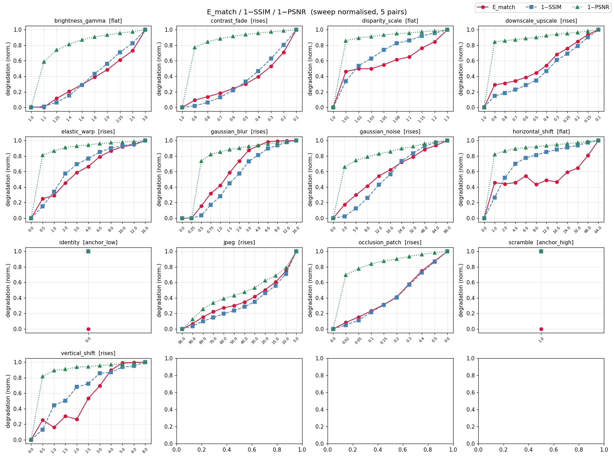
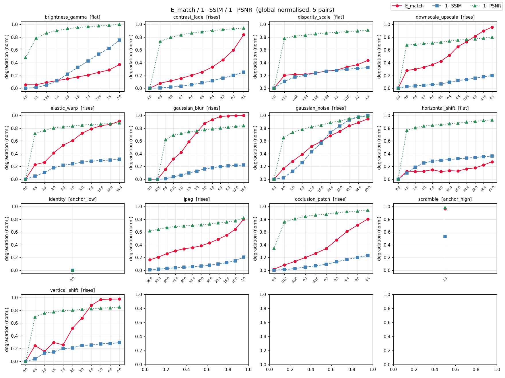
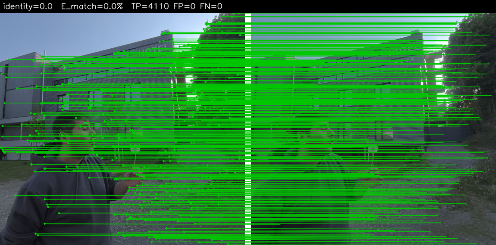

# Matchability

[](https://github.com/nandometzger/Matchability/actions/workflows/ci.yml)
[](LICENSE)
[](https://www.python.org)

A clean, tested reimplementation of the **Matchability Error** ($\mathcal{E}_{\text{Match}}$) — the
stereoscopic-fidelity metric from
**[Elastic3D: Controllable Stereo Video Conversion with Guided Latent Decoding](https://elastic3d.github.io)**
(Metzger et al., CVPR 2026). It measures whether a *predicted* right view preserves the same matchable,
epipolar-consistent texture as the *ground-truth* right view — a proxy for the binocular rivalry that makes
synthesized stereo uncomfortable to watch.

```python
from matchability import matchability_error

res = matchability_error(left, right_gt, right_pred)   # paths | PIL | numpy | torch all accepted
print(res.error_pct, res.tp, res.fp, res.fn)           # DeDoDe v2 auto-downloads on first call
```

## What it measures

Using a robust matcher (**DeDoDe v2**), we detect one fixed set of keypoints in the left image and ask which
of them have an **epipolar-consistent** match in the GT right view ($M_{gt}$) versus the predicted right view
($M_{pred}$). The error is the complement of their Jaccard index:

$$\mathcal{E}_{\text{Match}} = 1 - \frac{|M_{gt}\cap M_{pred}|}{|M_{gt}\cup M_{pred}|} = \frac{N_{FP}+N_{FN}}{N_{TP}+N_{FP}+N_{FN}}$$

- **TP** — correct, matchable detail preserved in both views.
- **FP** (hallucination) — detail matchable in the prediction but not in the GT (the model *invented* geometry).
- **FN** (omission) — detail matchable in the GT but lost in the prediction (over-smoothing / blur).

A **lower** error means the synthesized view keeps consistent, matchable texture along the correct epipolar
geometry. The full operational definition (including the choices the paper leaves implicit) is in
[`docs/metric.md`](docs/metric.md).

## Install

```bash
pip install -e .          # torch + kornia come as core deps; DeDoDe v2 works out of the box
# optional extras:
pip install -e ".[viz]"   # matplotlib, for the sensitivity plots
pip install -e ".[dev]"   # pytest + ruff
```

The DeDoDe v2 checkpoint is auto-downloaded and cached on first use, and the device is auto-selected
(**mps** > cuda > cpu) — Apple-Silicon MPS is first-class.

## Usage

### Python

```python
from matchability import Matchability

metric = Matchability()                          # default DeDoDe v2; loads the model once
res = metric(left, right_gt, right_pred)
print(f"E_match = {res.error_pct:.1f}%  (TP={res.tp}, FP={res.fp}, FN={res.fn})")

# tune knobs / pick a device explicitly:
metric = Matchability(tau=2.0, n_keypoints=5000, working_resolution=768, device="mps")
```

### Command line

```bash
matchability left.png right_gt.png right_pred.png            # uses DeDoDe v2
matchability left.png right_gt.png right_pred.png --backend classical --viz overlay.png
```

### Backends

| Backend | Use | Notes |
| --- | --- | --- |
| `DeDoDeV2Matcher` (default) | faithful metric | kornia DeDoDe v2 (`L-C4-v2` + `G-upright`), MPS/CUDA/CPU |
| `ClassicalMatcher` | fast / weight-free | SIFT + mutual-NN; used in CI |
| `MockMatcher` | unit tests | deterministic, programmable |

The metric core is matcher-agnostic — pass any `Matcher` to `Matchability(matcher=...)`.

## Empirical sensitivity study

### What was run

We swept 13 distortions across their severity ranges on 5 real **Apple Vision Pro** spatial video
(MV-HEVC format) stereo pairs. For each pair, the GT right view was distorted to simulate a
*predicted* right view (`R_pred = distort(R_gt)`), and `E_match` was computed with DeDoDe v2
(768 px, 5000 keypoints, τ=2 px) alongside SSIM and PSNR for comparison. This reproduces the
sensitivity analysis from Appendix D.1 of the Elastic3D paper.

Each stereo pair is a single frame extracted from a 2200×2200 AVP video (left and right eyes
stored as separate views in one MV-HEVC file). Metrics are averaged over the 5 videos.

### Expected results

The key discriminating property of `E_match` vs. plain image quality metrics (SSIM / PSNR):
- **Texture distortions** (blur, noise, JPEG) → `E_match` rises sharply as keypoints are destroyed.
  SSIM / PSNR also degrade, but `E_match` is more sensitive to early, subtle texture loss.
- **Geometric distortions** (horizontal shift, disparity scale) → `E_match` stays flat because
  DeDoDe is translation-invariant. SSIM / PSNR degrade (pixels move) while stereo fidelity is intact.
- **Epipolar violations** (vertical shift) → `E_match` rises because matches become inconsistent
  with the epipolar constraint (|Δy| > τ = 2px), while SSIM/PSNR barely change for small shifts.

This decoupling — sensitivity to texture loss and epipolar violations, robustness to pure geometry
changes — is what makes `E_match` a better proxy for stereo comfort than pixel-level metrics.

### Results

E_match / 1-SSIM / 1-PSNR all min-max scaled and degradation-aligned (all curves rise with severity):



*Crimson = E_match, steel-blue = 1−SSIM, sea-green = 1−PSNR (all normalised per-distortion so
curves can be compared regardless of absolute scale). Notice the geometric distortions
(horizontal_shift, disparity_scale) where SSIM/PSNR degrade but E_match stays flat.*

The same view globally normalised across all distortions (showing absolute sensitivity):



The classic distortion grid (E_match % + SSIM, no normalisation):


### Distortion catalogue

| Distortion | Family | Expected trend | What it tests |
| --- | --- | --- | --- |
| `identity` | anchor | `anchor_low` (≈0%) | Baseline: identical views → near-zero error |
| `scramble` | anchor | `anchor_high` (≈96%) | Worst case: random pixel shuffle → no matches |
| `gaussian_blur` | texture | rises sharply | Over-smoothing destroys keypoint texture |
| `gaussian_noise` | texture | rises | Salt-and-pepper pattern disrupts descriptors |
| `jpeg` | texture | rises | Compression artefacts bleed into descriptors |
| `downscale_upscale` | texture | rises | Bicubic downsample + upsample loses HF texture |
| `contrast_fade` | texture | rises | Low-contrast regions become ambiguous to match |
| `horizontal_shift` | geometric | flat | Pure horizontal disparity offset — DeDoDe invariant |
| `disparity_scale` | geometric | flat | Horizontal stretch (wrong stereo strength) — geometry only |
| `vertical_shift` | geometric | rises | Breaks epipolar (|Δy| > τ) — matches filtered out |
| `elastic_warp` | geometric | rises | Smooth spatial warp that disrupts both descriptor and geometry |
| `brightness_gamma` | photometric | flat | Global tone curve — DeDoDe descriptors are robust |
| `occlusion_patch` | structural | rises ∝ area | Black patch simulates disocclusion; error ∝ occluded fraction |

### Match overlays (video 0001)

The TP/FP/FN decomposition is visible per match — **green** = true positive (texture preserved),
**orange** = false positive (hallucination), **red dot** = false negative (omission, drawn on the
left image since there is no right-image coordinate):

| Identity (baseline) | Gaussian blur (σ=8) |
| :---: | :---: |
|  |  |

| Horizontal shift (32px, flat) | Vertical shift (6px, epipolar break) |
| :---: | :---: |
|  |  |

| Occlusion patch (50% area) | |
| :---: | :---: |
|  | |

Full numbers (DeDoDe v2, 5 pairs, 768 px, τ=2px):

| Distortion | Expected | `E_match` min → max | SSIM min → max | PSNR(dB) min → max |
| --- | --- | --- | --- | --- |
| identity | anchor_low | 0.0% → 0.0% | 1.00 → 1.00 | 100 → 100 |
| scramble | anchor_high | 96.2% → 96.2% | 0.50 → 0.50 | 12.0 → 12.0 |
| gaussian_blur | rises | 0.0% → 99.7% | 1.00 → 0.79 | 100 → 25.0 |
| gaussian_noise | rises | 0.0% → 94.6% | 1.00 → 0.07 | 100 → 11.6 |
| jpeg | rises | 16.4% → 80.1% | 0.99 → 0.81 | 44.7 → 26.7 |
| downscale_upscale | rises | 0.0% → 95.6% | 1.00 → 0.81 | 100 → 28.5 |
| contrast_fade | rises | 0.0% → 83.8% | 1.00 → 0.76 | 100 → 15.7 |
| horizontal_shift | flat | 0.0% → 27.5% | 1.00 → 0.66 | 100 → 16.8 |
| disparity_scale | flat | 0.0% → 43.5% | 1.00 → 0.70 | 100 → 18.6 |
| vertical_shift | rises | 0.0% → 97.6% | 1.00 → 0.73 | 100 → 23.9 |
| elastic_warp | rises | 0.0% → 90.8% | 1.00 → 0.71 | 100 → 21.1 |
| brightness_gamma | flat | 5.5% → 37.1% | 1.00 → 0.29 | 57.0 → 10.7 |
| occlusion_patch | rises | 1.8% → 80.4% | 1.00 → 0.78 | 69.3 → 15.9 |

To reproduce the study from scratch:

```bash
python scripts/extract_frames.py --input-dir data/raw --output-dir data/frames
python scripts/run_sensitivity.py --backend dedode --working-resolution 768
# -> experiments/results/{sensitivity_grid.png, comparison_{sweep,global}.png,
#                          sensitivity.csv, summary.md, matches_*.png}
```

To regenerate only plots from an existing CSV (no DeDoDe sweep):

```bash
python scripts/plot_results.py
# -> sensitivity_grid.png, comparison_{sweep,global}.png, summary.md (reads sensitivity.csv)
```

## Development

```bash
pip install -e ".[dev,viz]"
pytest -m "not dedode"     # fast unit + property tests (no model weights)
pytest -m dedode           # slow: real DeDoDe v2 (downloads weights once)
ruff check .
```

Built test-first. CI runs the fast suite on every push/PR; an opt-in job exercises the real DeDoDe backend.
Commits follow [Conventional Commits](https://www.conventionalcommits.org/) and versioning is automated with
[release-please](https://github.com/googleapis/release-please) — see [`CONTRIBUTING.md`](CONTRIBUTING.md).

## Citation

```bibtex
@inproceedings{metzger2026elastic3d,
  title     = {Elastic3D: Controllable Stereo Video Conversion with Guided Latent Decoding},
  author    = {Metzger, Nando and Truong, Prune and Bhat, Goutam and Schindler, Konrad and Tombari, Federico},
  booktitle = {Proceedings of the IEEE/CVF Conference on Computer Vision and Pattern Recognition (CVPR)},
  year      = {2026},
}
```

## License

[MIT](LICENSE)
