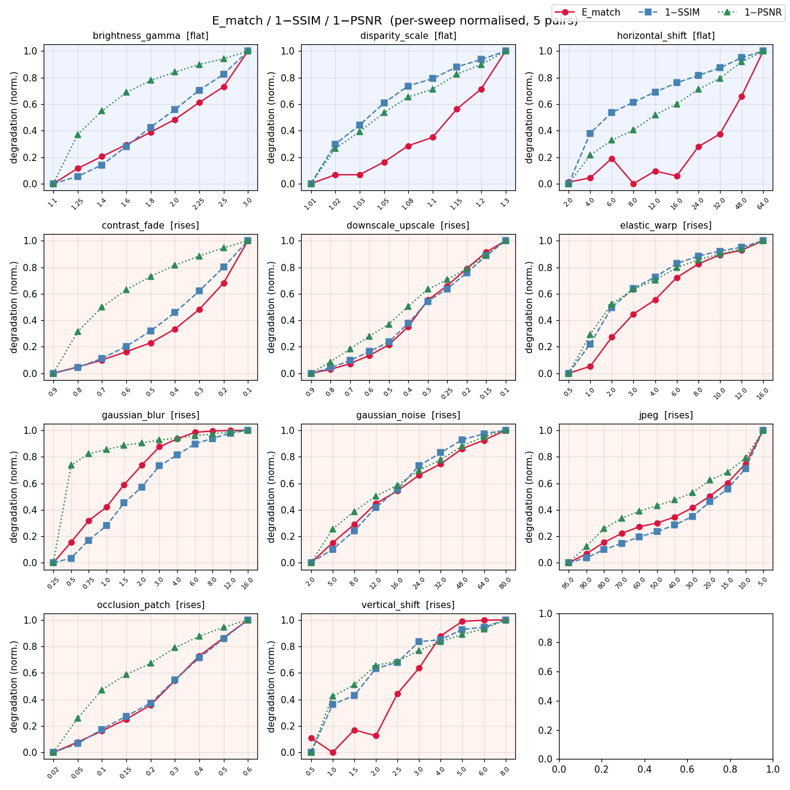
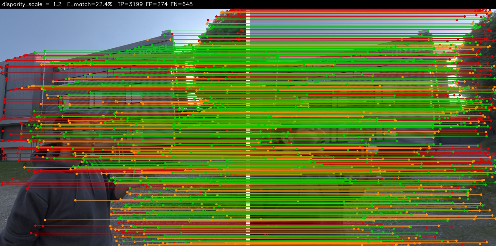
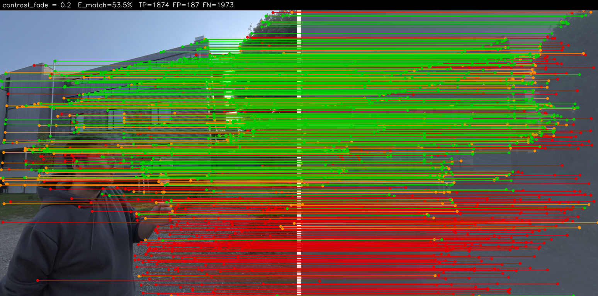
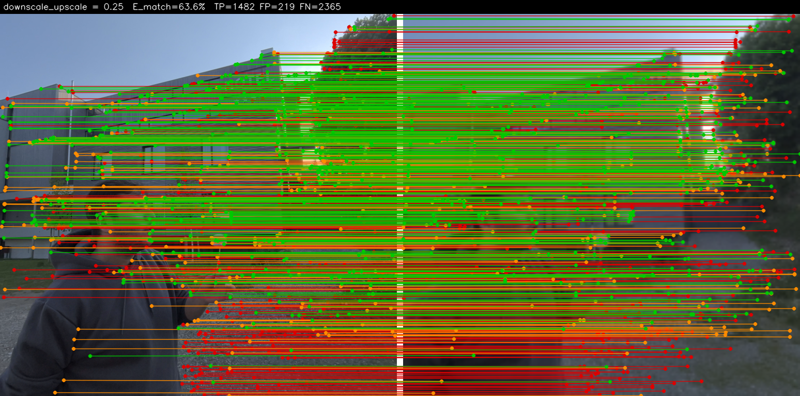
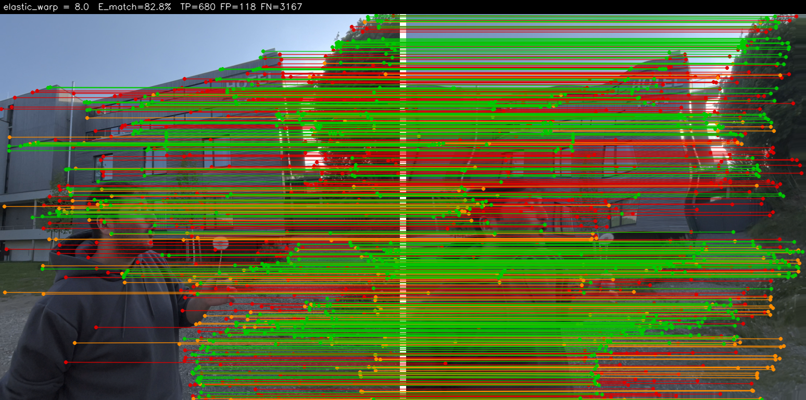
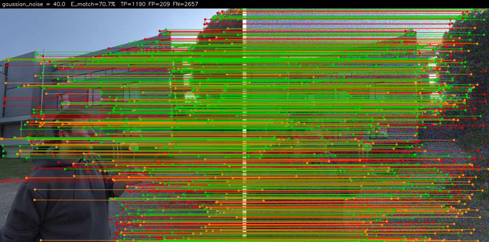
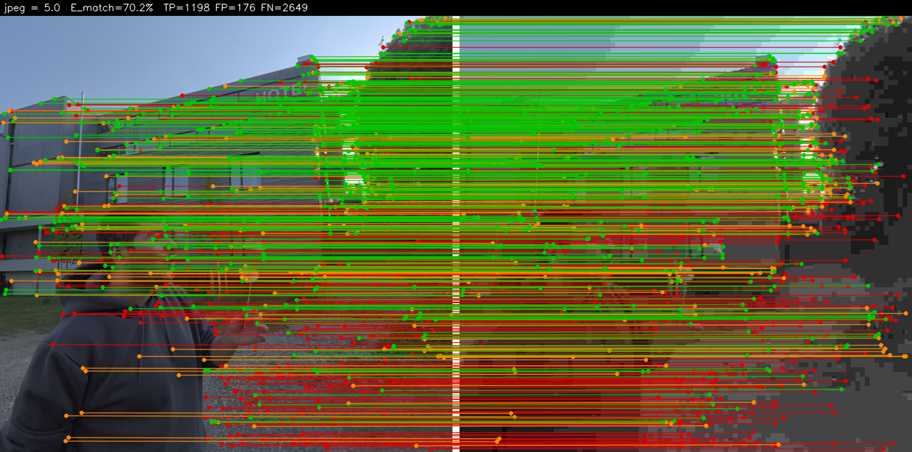
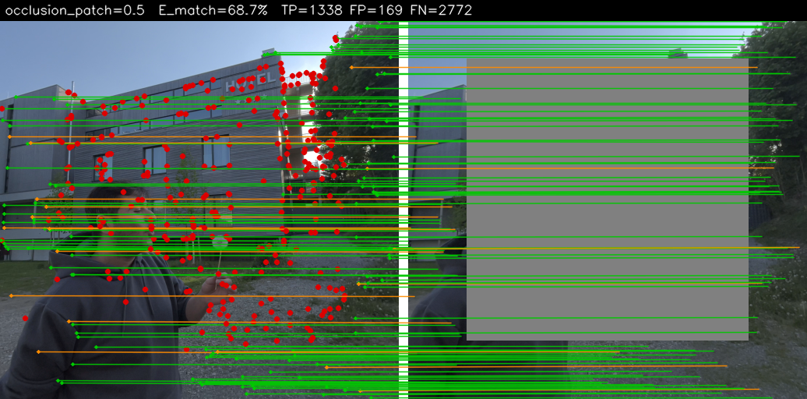
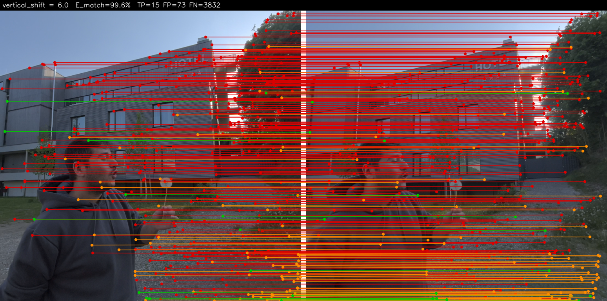
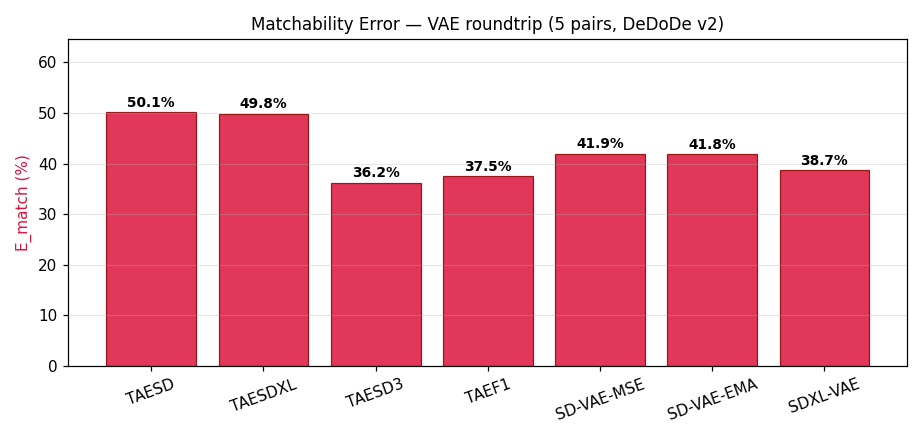

# Matchability

[](https://github.com/nandometzger/Matchability/actions/workflows/ci.yml)
[](LICENSE)
[](https://www.python.org)

A clean, tested reimplementation of the **Matchability Error** ($\mathcal{E}_{\text{Match}}$) — the
stereoscopic-fidelity metric from
**[Elastic3D: Controllable Stereo Video Conversion with Guided Latent Decoding](https://elastic3d.github.io)**
(Metzger et al., CVPR 2026). It measures whether a *predicted* right view preserves the same matchable,
epipolar-consistent texture as the *ground-truth* right view — a proxy for the binocular rivalry that makes
synthesized stereo uncomfortable to watch.

```python
from matchability import matchability_error

res = matchability_error(left, right_gt, right_pred)   # paths | PIL | numpy | torch all accepted
print(res.error_pct, res.tp, res.fp, res.fn)           # DeDoDe v2 auto-downloads on first call
```

## What it measures

Using a robust matcher (**DeDoDe v2**), we detect one fixed set of keypoints in the left image and ask which
of them have an **epipolar-consistent** match in the GT right view ($M_{gt}$) versus the predicted right view
($M_{pred}$). The error is the complement of their Jaccard index:

$$\mathcal{E}_{\text{Match}} = 1 - \frac{|M_{gt}\cap M_{pred}|}{|M_{gt}\cup M_{pred}|} = \frac{N_{FP}+N_{FN}}{N_{TP}+N_{FP}+N_{FN}}$$

- 🟢 **TP** — correct, matchable detail preserved in both views.
- 🟠 **FP** (hallucination) — detail matchable in the prediction but not in the GT (invented geometry).
- 🔴 **FN** (omission) — detail matchable in the GT but lost in the prediction (over-smoothing / blur).

A **lower** error means the synthesized view keeps consistent, matchable texture along the correct epipolar
geometry. The full operational definition (including choices the paper leaves implicit) is in
[`docs/metric.md`](docs/metric.md).

## Install

```bash
pip install -e .          # torch + kornia come as core deps; DeDoDe v2 works out of the box
pip install -e ".[viz]"   # + matplotlib, for sensitivity plots
pip install -e ".[dev]"   # + pytest + ruff
```

The DeDoDe v2 checkpoint is auto-downloaded and cached on first use, and the device is auto-selected
(**mps** > cuda > cpu) — Apple-Silicon MPS is first-class.

## Usage

### Python

```python
from matchability import Matchability

metric = Matchability()                          # default DeDoDe v2; loads the model once
res = metric(left, right_gt, right_pred)
print(f"E_match = {res.error_pct:.1f}%  (TP={res.tp}, FP={res.fp}, FN={res.fn})")

# tune knobs / pick a device explicitly:
metric = Matchability(tau=2.0, n_keypoints=5000, working_resolution=768, device="mps")
```

### Command line

```bash
matchability left.png right_gt.png right_pred.png
matchability left.png right_gt.png right_pred.png --backend classical --viz overlay.png
```

### Backends

| Backend | Use | Notes |
| --- | --- | --- |
| `DeDoDeV2Matcher` (default) | faithful metric | kornia DeDoDe v2 (`L-C4-v2` + `G-upright`), MPS/CUDA/CPU |
| `ClassicalMatcher` | fast / weight-free | SIFT + mutual-NN; used in CI |
| `MockMatcher` | unit tests | deterministic, programmable |

The metric core is matcher-agnostic — pass any `Matcher` to `Matchability(matcher=...)`.

---

## Empirical sensitivity study

### Setup

We swept 11 distortions across their severity ranges on 5 real **Apple Vision Pro** spatial video
(MV-HEVC format) stereo pairs. For each pair, the GT right view was distorted to simulate a
*predicted* right view (`R_pred = distort(R_gt)`), and `E_match` was computed with DeDoDe v2
(768 px, 5000 keypoints, τ=2 px) alongside SSIM and PSNR for comparison. This reproduces the
sensitivity analysis from Appendix D.1 of the Elastic3D paper.

Each stereo pair is a single frame extracted from a 2200×2200 AVP video (left and right eyes
stored as separate views in one MV-HEVC file). Metrics are averaged over the 5 videos.

### Results



*Crimson = E_match, steel-blue = 1−SSIM, sea-green = 1−PSNR (normalised per-distortion).
Top row: insensitive distortions — E_match stays flat while SSIM/PSNR degrade (pixel-level change
without stereo-fidelity loss). Remaining rows: sensitive distortions — E_match rises sharply.*

### Why E_match is different from SSIM/PSNR

- **Texture distortions** (blur, noise, JPEG) → `E_match` rises sharply as keypoints are destroyed.
- **Geometric distortions** (horizontal shift, disparity scale) → `E_match` stays flat because
  DeDoDe is translation-invariant. SSIM/PSNR degrade while stereo fidelity is intact.
- **Epipolar violations** (vertical shift) → `E_match` rises because matches are filtered by
  the epipolar constraint (|Δy| > τ = 2px), while SSIM/PSNR barely change for small shifts.

### Distortion catalogue

**Insensitive (flat) — E_match should stay low despite pixel-level degradation:**

| Distortion | Family | What it tests |
| --- | --- | --- |
| `disparity_scale` | geometric | Horizontal stretch (wrong stereo strength) — only geometry, not texture |
| `horizontal_shift` | geometric | Pure horizontal disparity offset — DeDoDe is translation-invariant |

**Sensitive (rises) — E_match should rise with severity:**

| Distortion | Family | What it tests |
| --- | --- | --- |
| `contrast_fade` | texture | Low-contrast regions become ambiguous to match |
| `downscale_upscale` | texture | Bicubic downsample + upsample loses high-frequency texture |
| `elastic_warp` | geometric | Smooth spatial warp disrupts both descriptor and epipolar geometry |
| `gaussian_blur` | texture | Over-smoothing destroys keypoint texture |
| `gaussian_noise` | texture | Salt-and-pepper pattern disrupts descriptors |
| `jpeg` | texture | Compression artefacts bleed into descriptors |
| `occlusion_patch` | structural | Black patch simulates disocclusion; error ∝ occluded fraction |
| `vertical_shift` | geometric | Breaks epipolar consistency (|Δy| > τ) — matches filtered out |

### Match overlays (video 0001)

Matches are drawn as coloured lines on a left ∥ right composite:
🟢 **TP** — preserved in both GT and pred &nbsp;|&nbsp; 🟠 **FP** — in pred but not GT (hallucination) &nbsp;|&nbsp; 🔴 **FN** — in GT but absent in pred (omission, line points to expected location)

**Insensitive — mostly 🟢, E_match stays low:**

| Disparity scale (×1.2, 22.4%) | Horizontal shift (32px, 6.7%) |
| :---: | :---: |
|  |  |

**Sensitive — increasing 🔴🟠 with severity:**

| Contrast fade (×0.2, 53.5%) | Downscale+upscale (×0.25, 63.6%) | Elastic warp (a=8, 82.8%) |
| :---: | :---: | :---: |
|  |  |  |

| Gaussian blur (σ=8, 99.7%) | Gaussian noise (σ=40, 70.7%) | JPEG (q=5, 70.2%) |
| :---: | :---: | :---: |
|  |  |  |

| Occlusion patch (50%, 70.6%) | Vertical shift (6px, 99.6%) | |
| :---: | :---: | :---: |
|  |  | |

Full numbers (DeDoDe v2, 5 pairs, 768 px, τ=2px):

| Distortion | Expected | `E_match` min → max | SSIM min → max | PSNR(dB) min → max |
| --- | --- | --- | --- | --- |
| **insensitive (flat)** | | | | |
| disparity_scale | flat | 0.0% → 43.5% | 1.00 → 0.70 | 100 → 18.6 |
| horizontal_shift | flat | 0.0% → 27.5% | 1.00 → 0.66 | 100 → 16.8 |
| **sensitive (rises)** | | | | |
| contrast_fade | rises | 0.0% → 83.8% | 1.00 → 0.76 | 100 → 15.7 |
| downscale_upscale | rises | 0.0% → 95.6% | 1.00 → 0.81 | 100 → 28.5 |
| elastic_warp | rises | 0.0% → 90.8% | 1.00 → 0.71 | 100 → 21.1 |
| gaussian_blur | rises | 0.0% → 99.7% | 1.00 → 0.79 | 100 → 25.0 |
| gaussian_noise | rises | 0.0% → 94.6% | 1.00 → 0.07 | 100 → 11.6 |
| jpeg | rises | 16.4% → 80.1% | 0.99 → 0.81 | 44.7 → 26.7 |
| occlusion_patch | rises | 1.8% → 80.4% | 1.00 → 0.78 | 69.3 → 15.9 |
| vertical_shift | rises | 0.0% → 97.6% | 1.00 → 0.73 | 100 → 23.9 |

To reproduce the study from scratch:

```bash
python experiments/scripts/extract_frames.py --input-dir data/raw --output-dir data/frames
python experiments/scripts/run_sensitivity.py --backend dedode --working-resolution 768
python experiments/scripts/generate_overlays.py   # regenerate overlays only (fast)
```

To regenerate only the plots from an existing CSV:

```bash
python experiments/scripts/plot_results.py
```

---

## VAE roundtrip experiment

A separate experiment measures how **VAE encode-decode cycles** degrade the Matchability metric.
Five publicly available VAEs are compared — from the tiny ~4 MB autoencoders used for live preview
in diffusion pipelines to the full KL-regularised VAEs used in Stable Diffusion and SDXL.



| VAE | HuggingFace repo | Architecture | E_match |
| --- | --- | --- | --- |
| TAESD | `madebyollin/taesd` | AutoencoderTiny (SD1) | 50.1% |
| TAESDXL | `madebyollin/taesdxl` | AutoencoderTiny (SDXL) | 49.8% |
| SD-VAE-MSE | `stabilityai/sd-vae-ft-mse` | AutoencoderKL (SD1) | 41.9% |
| SD-VAE-EMA | `stabilityai/sd-vae-ft-ema` | AutoencoderKL (SD1) | 41.8% |
| SDXL-VAE | `madebyollin/sdxl-vae-fp16-fix` | AutoencoderKL (SDXL) | 38.7% |

All VAEs introduce non-trivial E_match degradation (~39–50%), substantially higher than pure
geometric distortions at the same SSIM level. The tiny autoencoders (TAESD/TAESDXL) show
~8–11pp higher E_match than full KL-VAEs — highlighting that E_match is more sensitive to the
high-frequency texture loss that VAE compression introduces.

```bash
pip install diffusers accelerate
python experiments/scripts/run_vae_experiment.py --backend dedode
```

---

## Development

```bash
pip install -e ".[dev,viz]"
pytest -m "not dedode"     # fast unit + property tests (no model weights)
pytest -m dedode           # slow: real DeDoDe v2 (downloads weights once)
ruff check .
```

CI runs the fast suite on every push/PR. An opt-in job exercises the real DeDoDe backend on a
weekly schedule. Commits follow [Conventional Commits](https://www.conventionalcommits.org/) and
versioning is automated with [release-please](https://github.com/googleapis/release-please) — see
[`CONTRIBUTING.md`](CONTRIBUTING.md).

## Citation

```bibtex
@inproceedings{metzger2026elastic3d,
  title     = {Elastic3D: Controllable Stereo Video Conversion with Guided Latent Decoding},
  author    = {Metzger, Nando and Truong, Prune and Bhat, Goutam and Schindler, Konrad and Tombari, Federico},
  booktitle = {Proceedings of the IEEE/CVF Conference on Computer Vision and Pattern Recognition (CVPR)},
  year      = {2026},
}
```

## License

[MIT](LICENSE)
